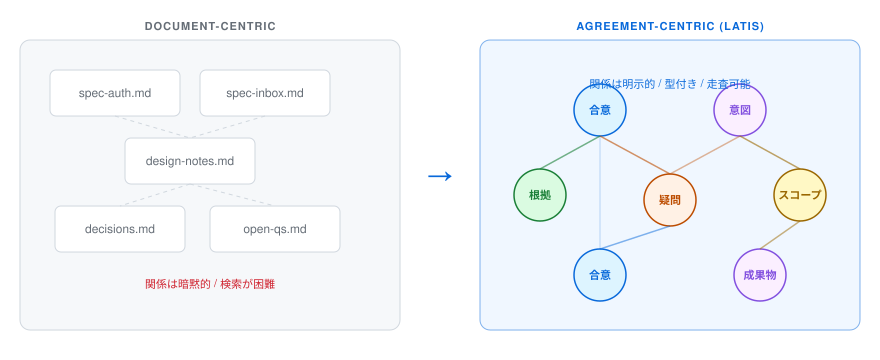
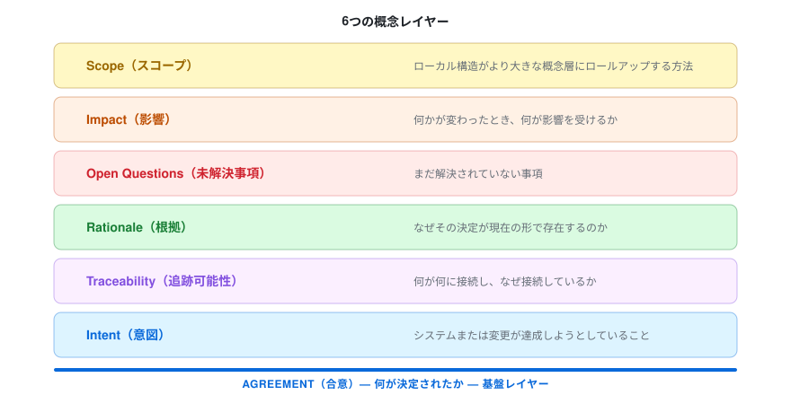
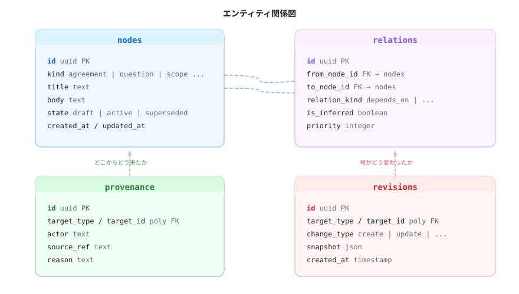
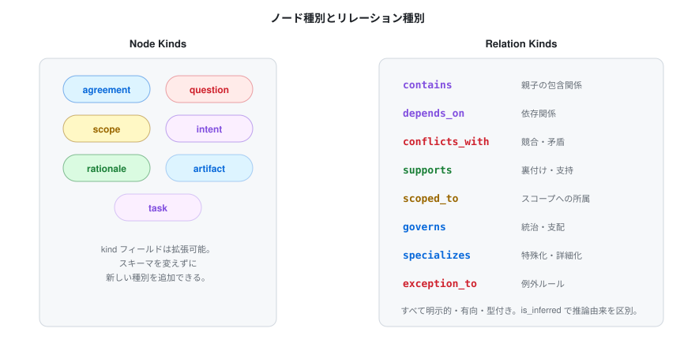
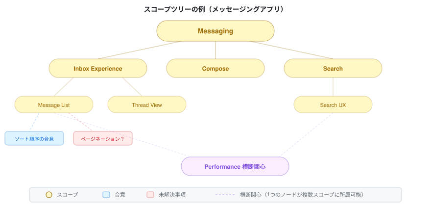
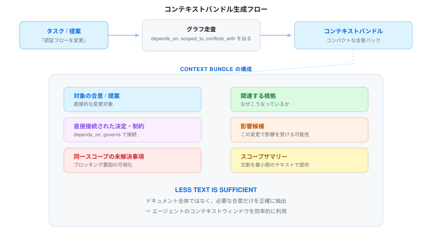
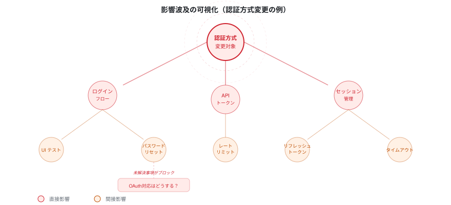
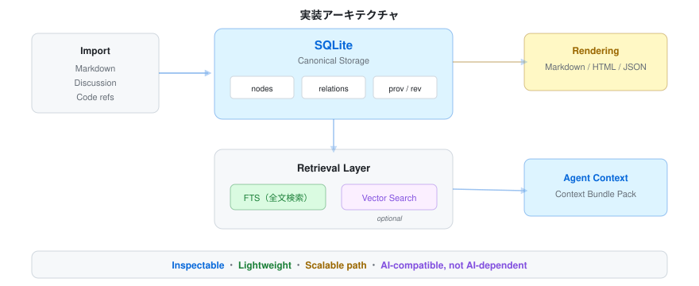
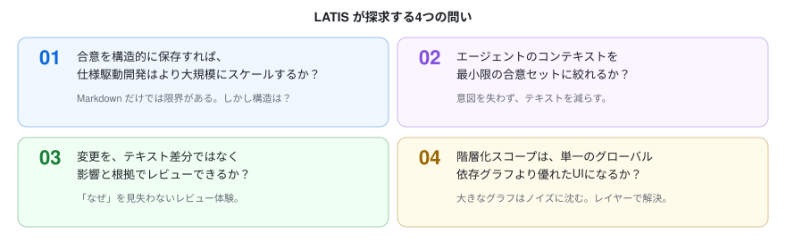

# LATIS

**Layered Agreement, Traceability & Intent System**  
**An Agreement Engine.**

**Language:** [English](README.md) | **日本語**

## 目次

- [LATIS が必要な理由](#latis-が必要な理由)
- [関連ドキュメント](#関連ドキュメント)
- [基本アイデア](#基本アイデア)
- [LATIS が提供したいもの](#latis-が提供したいもの)
- [設計原則](#設計原則)
- [提案スキーマ](#提案スキーマ)
- [なぜスコープをノードとして扱うのか](#なぜスコープをノードとして扱うのか)
- [取得されるコンテキストの形](#取得されるコンテキストの形)
- [影響分析](#影響分析)
- [初期実装の方針](#初期実装の方針)
- [やらないこと](#やらないこと)
- [初期の方向性](#初期の方向性)
- [OpenSpec との関係](#openspec-との関係)
- [現在の状況](#現在の状況)
- [なぜオープンソースなのか](#なぜオープンソースなのか)
- [長期的な見通し](#長期的な見通し)
- [コントリビュートについて](#コントリビュートについて)
- [補足](#補足)

LATISは、ソフトウェア開発における合意事項の構造化、追跡、運用を行うための実験的なオープンソースシステムです。

その出発点は、ある単純な観察結果にあります。すなわち、仕様主導型開発はAI支援コーディングと組み合わせると非常に高い効果を発揮しますが、仕様が膨大になり、分岐し、重複し、互いに影響し合うようになると、円滑に拡張できなくなるというものです。

Markdown文書は可読性を保ちますが、検索、影響分析、エージェントのコンテキスト構築には不向きです。LATISは異なるアプローチを模索しています。すなわち、合意事項、意図、根拠、未解決の課題、依存関係を第一級の構造化オブジェクトとして扱い、必要に応じてそのシステムから人間が読める成果物を生成するというものです。

このプロジェクトは、AIコーディングを真剣に捉えている人々、そして仕様主導型開発がまだ実用的な限界に達していないと信じている人々のためのものです。

## 関連ドキュメント

- [`docs/LATIS_Spec.ja.md`](docs/LATIS_Spec.ja.md) — LATIS の定義、境界、中核機能
- [`docs/LATIS_API.ja.md`](docs/LATIS_API.ja.md) — プロトタイプ API 仕様
- [`docs/LATIS_Operation.ja.md`](docs/LATIS_Operation.ja.md) — 日常運用フローと役割分担
- [`docs/LATIS_Concerns.ja.md`](docs/LATIS_Concerns.ja.md) — 現時点の懸念事項と解決案

## LATIS が必要な理由

現代のAIコーディングワークフローは、局所的な実行には優れているが、永続的な共有コンテキストの維持には弱い。

プロジェクトが拡大するにつれ、チームもエージェントも同様に次のような問題に直面する：

- 仕様書は読みやすいが、正確にクエリを立てるのが難しい
- 関連する決定事項が、ドキュメント、コード、議論のあちこちに散在している
- 未解決の疑問を見失いやすい
- 根拠は、残されたテキストよりも早く薄れていく
- 意味のある変更を行うたびに、プロンプトに無関係なコンテキストが過剰に混入するリスクがある
- 影響は、追跡されるよりも推測されることが多い

LATISは、仕様主導開発を当初の魅力を損なうことなく、よりスケーラブルにするための試みである。

## 基本アイデア

LATISは、ドキュメントを基本単位とは見なしていません。

その代わりに、開発に関する知識を階層化された合意構造としてモデル化しています：

- **合意** — 何が決定されたか
- **意図** — システムや変更が達成しようとしていること
- **トレーサビリティ** — 何が何とつながっているか、そしてその理由
- **根拠** — なぜその決定が現在の形をとっているのか
- **未解決の課題** — まだ解決されていないこと
- **影響** — 何かが変化した際に何が影響を受けるか
- **範囲** — 局所的な構造が、より大きな概念的レイヤーにどのように集約されるか

文書は依然として重要です。ただ、意味が存在する唯一の場所ではなくなっただけです。

## LATIS が提供したいもの

### 1. 標準的な合意モデル
決定事項、制約、質問、関係性、および履歴を構造化して表現したもの。

### 2. 追跡可能な変更
次のような質問に答えるための仕組み：

- この決定は何に依存しているか？
- この提案はどのような影響を与えるか？
- どの未解決の質問がこの変更を阻んでいるか？
- そもそもなぜこれが合意されたのか？

### 3. AIエージェントのためのコンテキスト
エージェントに仕様書のフォルダ全体を渡す代わりに、LATISは現在のタスクに関連する合意のみを含むコンパクトなコンテキストパックを組み立てられるべきである。

### 4. 人間が読みやすいビュー
Markdownは排除されません。標準的な保存形式から、単なるレンダリング形式の一つへと位置づけが変更されます。

### 5. スコープを意識した可視化
大規模なグラフも、ノイズに埋もれてしまえば役に立ちません。LATISは、階層化されたスコープ、ローカルなグラフビュー、影響度レンズ、および履歴を意識した探索をサポートすることを目指しています。

## 設計原則

### 合意を最優先
システムは、合意された内容、未確定な点、および各決定の根拠となる要素を保持すべきである。

### フラットではなく階層的
ソフトウェアの構造は、単一のグローバルなグラフよりも、スコープや階層を通じて理解しやすい。

### 推測ではなくトレーサビリティ
システムは、影響や依存関係を暗黙的なものではなく、可視化すべきである。

### デフォルトで人間が読みやすい
内部モデルが構造化されていても、エクスポートされた成果物は、検査、レビュー、差分確認、および議論が容易であるべきである。

### AIとの互換性、AIへの依存ではない
LATISは、有用な場合には埋め込み、クラスタリング、再ランク付け、言語モデルを活用すべきであるが、中核となるデータモデルは不透明な生成に依存してはならない。

## 提案スキーマ

### 本質的な要素として扱うもの

現在の設計では、次のものを後から代替しにくい要素とみなしています。

- 安定した識別子
- 型を持つノード
- 型付きの有向関係
- 来歴・出所
- 変更履歴
- 階層化されたスコープ構造

LATIS では scope を単なるタグやカテゴリとしては扱いません。LATIS における scope は構造ノードです。つまり、合意を束ね、階層に参加し、ナビゲーション、検索、影響分析の基盤になるものです。

### コアエンティティ

LATIS は、まず次の4つの canonical table から始められます。

#### `nodes`（ノード本体）
意味を持つ第一級の単位を格納します。

代表的なフィールド:

- `id`（識別子）
- `kind`（ノード種別）
- `title`（タイトル）
- `body`（本文）
- `state`（状態）
- `created_at`（作成日時）
- `updated_at`（更新日時）

代表的なノード種別:

- `agreement`（合意・決定事項）
- `question`（未解決事項）
- `scope`（スコープ・構造単位）
- `intent`（意図・目的）
- `rationale`（根拠・理由）
- `artifact`（成果物・文書参照）
- `task`（タスク）

厳密な種類の集合は今後変わりえます。重要なのは、モデルの形を壊さずに kinds を区別できることです。

#### `relations`（ノード間の関係）
ノード同士の、型付きで有向の接続を格納します。

代表的なフィールド:

- `id`（識別子）
- `from_node_id`（始点ノードID）
- `to_node_id`（終点ノードID）
- `relation_kind`（関係種別）
- `state`（関係の状態）
- `priority`（優先度）
- `is_inferred`（推定された関係かどうか）

代表的な関係種別:

- `contains`（内包する・含む）
- `depends_on`（依存する）
- `conflicts_with`（競合する）
- `supports`（支える・根拠になる）
- `scoped_to`（このスコープに属する）
- `governs`（上位原理として支配する）
- `specializes`（より具体化する）
- `exception_to`（例外である）

ここで重要なのは、語彙の最終形ではなく、「関係が明示され、有向で、型を持つ」という点です。

#### `provenance`（来歴・出所）
それがどこから来たのか、誰が導入したのか、なぜ存在するのかを格納します。

代表的なフィールド:

- `id`（識別子）
- `target_type`（対象種別: node / relation など）
- `target_id`（対象ID）
- `actor`（作成者・関与者）
- `source_ref`（元文書や元議論への参照）
- `reason`（理由・根拠）
- `created_at`（記録日時）

これは、rationale が暗黙のままでは失われやすい一方で、毎回必ず独立した上位文書に切り出す必要があるわけでもないからです。

#### `revisions`（改訂履歴）
履歴上の変更を格納します。

代表的なフィールド:

- `id`（識別子）
- `target_type`（変更対象の種別）
- `target_id`（変更対象のID）
- `change_type`（変更種別）
- `snapshot`（その時点のスナップショット）
- `created_at`（変更記録日時）

これは、LATIS が現在状態だけを見たいわけではないからです。proposal view、履歴追跡、変更中心の可視化を支えるには、変化自体を持てる必要があります。

## なぜスコープをノードとして扱うのか

LATIS における scope は、`Inbox` や `Search` のような単なるラベルではありません。

もし scope がカテゴリでしかなければ、ノードを分類することはできても、それ以上のことはあまりできません。階層、局所ズーム、名前付きの構造的まとまり、スコープを起点にした影響探索を自然には支えられません。

scope を node として持つことで、LATIS は次のようなことを表現できます。

- `メッセージ一覧` は `受信トレイの操作感` の一部である
- `受信トレイの操作感` は `メッセージ機能` の一部である
- 一つの agreement が、feature scope と concern scope の両方に属する
- scope 自体が、自動生成され、リネームされ、説明を持ち、履歴を持てる

このため、scope は平坦なタグというより、軽量な構造的結節点に近いものになります。scope 自体がルールとして振る舞う必要はありませんが、探索と検索の単位として意味を持つようになります。

## 取得されるコンテキストの形

retrieval layer は、デフォルトで文書全体を相手にしてはいけません。代わりに、グラフからコンパクトな context bundle を組み立てるべきです。

最小の bundle には、たとえば次のようなものが含まれます。

- 対象となる agreement または proposal
- 直接つながる決定や制約
- 同じ scope にある未解決事項
- 関連する rationale
- 近傍の impact candidate
- 短い scope summary

LATIS が目指していることの一つは、より少ないテキストで十分にすることです。

## 影響分析

ある合意を変更したとき、何が影響を受けるのか？ LATIS はグラフ走査によって影響範囲を自動的に可視化します。

推測ではなく、構造的な追跡可能性を提供します。未解決事項が変更をブロックしている場合も、明示的に可視化されます。

## 初期実装の方針

現実的な初期実装としては、次のような構成が考えられます。

- canonical storage としての SQLite
- lexical retrieval のための FTS
- semantic lookup のための optional な vector search
- 唯一の正本ではなく import/export 形式としての Markdown

これにより、初期段階では inspectable で軽量なまま保ちつつ、将来的により大きな retrieval backend へ進む余地も残せます。

## やらないこと

LATISは、以下の目的で使用することを想定していません：

- バージョン管理ツールの代替
- 万能なプロジェクト管理スイート
- 単なるグラフ可視化ツール
- グラフが添付されたドキュメントエディタ
- AIの出力を絶対的なものとみなすシステム

## 初期の方向性

初期の検討は、以下の問いを中心に進められています：

1. 仕様が Markdown にしか存在しない場合より、構造的に保存された場合の方が、仕様主導型開発は大きな規模でも実用的でありうるか？
2. 重要な意図を損なうことなく、エージェントのコンテキストを最小限の関連合意セットに絞り込むことは可能か？
3. 変更内容を、単なるテキストの差分だけでなく、その影響と根拠を通じて確認することは可能か？
4. 階層化されたスコープは、単一のグローバルな依存関係グラフよりも優れたインターフェースとなり得るか？

## OpenSpec との関係

LATIS は OpenSpec のような仕様主導ワークフローと概念的に近いところがありますが、文書第一の artifact storage に限定されません。

近い実験として、OpenSpec 指向の extension や fork が別に存在するかもしれません。LATIS はそれより広い発想です。すなわち、人間と AI の協働のために、合意、トレーサビリティ、意図、および範囲を第一級の基盤として扱うシステムです。

## 現在の状況

本プロジェクトは現在、設計およびプロトタイピングの段階にあります。

現在の作業内容は以下の通りです：

- データモデルの検討
- アグリーメントグラフおよびスコープツリーの概念
- 影響度重視のUIモックアップ
- 提案内容および履歴の可視化に関するアイデア
- トレーサビリティ、設計根拠、および構造化された仕様書作成ワークフローに関する調査

## なぜオープンソースなのか

LATIS は検証可能であるべきです。

決定、根拠、意図を保存するシステムが、ユーザーにブラックボックスを信頼するよう要求するべきではありません。構造は見えるべきであり、モデルは議論可能であり、前提は修正可能であるべきです。

オープンソースは、こうしたツールにとって自然な環境でもあります。モデルを批判し、抽象化を改善し、このアプローチが実際にソフトウェア開発をより理解しやすくするかどうかを検証できるからです。

## 長期的な見通し

ソフトウェア開発がエージェントによって仲介されることが増えれば増えるほど、共通の意図、持続的な根拠、そして範囲を定めた合意の重要性は高まるばかりです。LATISは、そのような未来に向けたインフラを構築するためのささやかな試みです。

思考に取って代わるためではなく、思考が散在するファイルやプロンプト、そして忘れ去られた決定の中に埋もれてしまうのを防ぐために。

## コントリビュートについて

アイデア、批判、およびアーキテクチャに関する指摘を歓迎します。

初期段階で特に有用そうなのは、次のような貢献です。

- コアモデルへの批判
- 既存研究や既存ツールとの比較
- 具体的なワークフロー例
- agreement model が破綻する反例
- 保存、検索、またはレンダリング層のプロトタイプ実装

## 補足

モデルそのものを含め、すべてが変わる可能性があります。

それもまた、このプロジェクトの意図の一部です。
